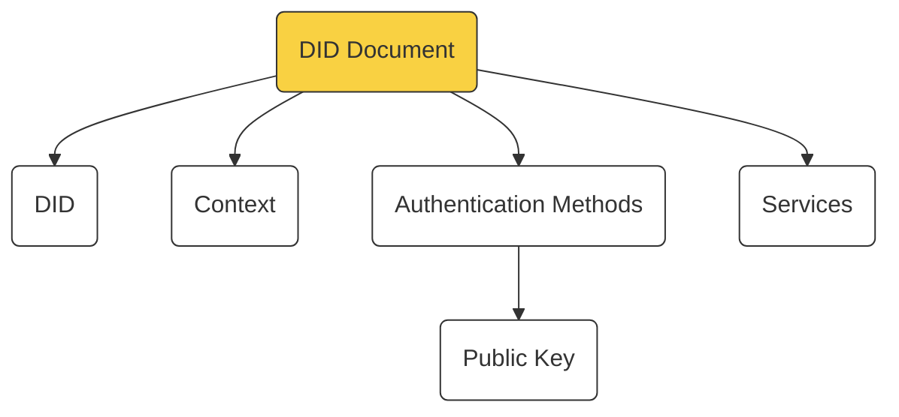
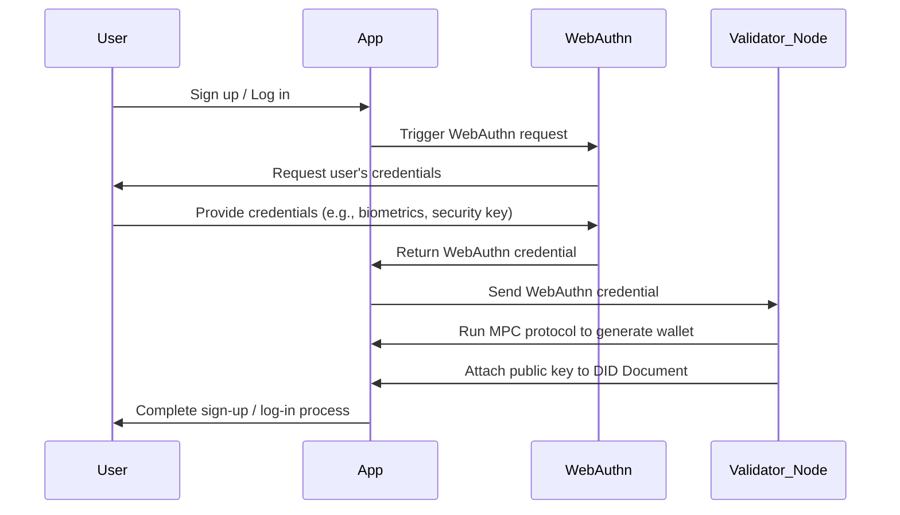
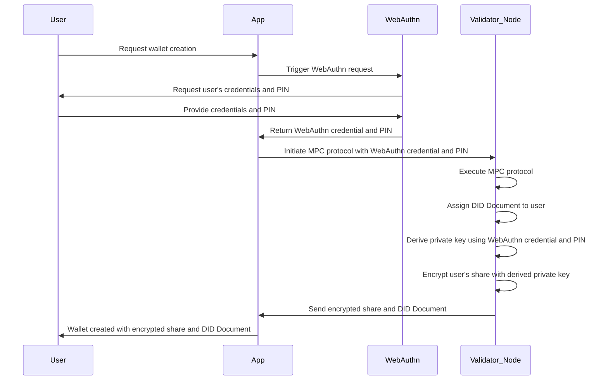
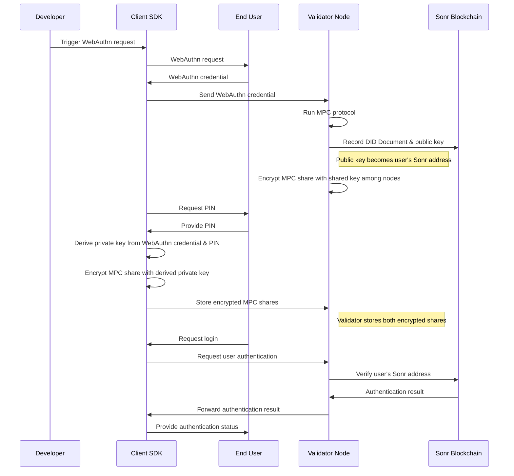

---
tags:
  - "#blockchain"
  - "#distributed-systems"
  - "#cryptographic-security"
  - "#did-integration"
  - "#cosmos-sdk"
  - "#decentralized-identity"
  - "#blockchain-architecture"
  - "#cross-chain-identity"
---
# Sonr Architecture

---

## Understanding the Blockchain

Sonr is a powerful blockchain technology that utilizes a unique approach to securely manage user identities and digital wallets. By leveraging cutting-edge cryptographic methods, Sonr provides a highly secure and user-friendly experience. In this article, we'll break down the core components of the Sonr blockchain and its account creation process in a non-technical manner, making it easier for non-technical founders to understand the technology behind Sonr.

## Technology

### DID Documents and the Cosmos SDK

At the heart of Sonr's identity management is the Decentralized Identifier (DID) Document. This document securely stores user information and their associated public keys on a blockchain powered by the Cosmos SDK. The Cosmos SDK is a modular framework that enables developers to build interoperable and scalable blockchain applications with ease.

### WebAuthn And Validator Nodes

When a user signs up on a website or application integrated with Sonr, the developer triggers a WebAuthn request. WebAuthn is a web standard for secure and seamless user authentication. This request is then sent to a Validator Node, a trusted party within the Sonr network responsible for processing and verifying user information.

### Multi-Party Computation MPC

After receiving the WebAuthn request, the Validator Node initiates a cryptographic process called Multi-Party Computation (MPC). This process enables the creation of a digital wallet on behalf of the user without revealing their sensitive information. The wallet's public key is then attached to the DID Document and serves as the user's unique Sonr address.

### Private Key Derivation and Encryption

To ensure maximum security, the user's private key is derived from their WebAuthn credentials and a personal identification number (PIN). This private key is used to encrypt one share of the MPC output, while the Validator Node encrypts the other share using a shared key known only to the nodes within the Sonr network. These encrypted shares are securely stored and can only be decrypted by their respective parties.

### User Authentication

With their Sonr address (public key) established, users can now authenticate themselves across various websites and applications integrated with Sonr. By providing their WebAuthn credentials and PIN, users can prove their identity without the need for usernames and passwords, streamlining the authentication process while maintaining high levels of security.

---

## Repository Structure

The Sonr repository contains the core blockchain functionality and components for building the decentralized identity network. It provides a modular structure that separates concerns into logical components focused on specific areas. The key components are:

### Application Logic

The `app` and `app/params` directories handle critical configuration, initialization and dependency injection when running a Sonr node. The `app.go` file builds the application instance.

### Cryptography

The `crypto` package implements advanced cryptographic primitives, protocols and algorithms that form the cryptographic building blocks. It provides techniques for signatures, zero-knowledge proofs, secret sharing, threshold cryptography, and more. Key components include:

- `core`: Fundamental primitives like elliptic curves, hashes, and commitments
- `accumulator`: Cryptographic accumulators for proving set membership
- `bulletproof`: Efficient zero-knowledge proofs like Bulletproofs
- `dkg`: Distributed key generation protocols
- `ot`: Oblivious transfer protocols
- `signatures`: Signature schemes including BLS, ECDSA, Schnorr, and BBS+
- `tecdsa`: Threshold ECDSA
- `ted25519`: Threshold Ed25519 based on FROST

### CLI and Business Logic

The `cmd/sonrd` package implements the command line interface and business logic. The `cmd` subdirectory defines the command handler structure using Cobra. `main.go` serves as the entry point, initializing settings and executing the root command. Networking and protocol logic is implemented in imported Go packages.

### Scripts

The `scripts` directory contains utilities to install, configure, and run Sonr nodes. Key scripts include:

- `entrypoint.sh`: Sets up a node from scratch
- `install-deps.sh`: Installs dependencies across platforms
- `install.sh`: Automates installation and component management
- `setup-dev.sh`: Sets up the development environment

### Common Utilities

The `common` directory provides utilities used across the codebase, focused on cryptographic primitives, configuration, errors, logging and testing.

### Building Blockchains

The `build` directory contains code for integrating with blockchain networks and components. Subdirectories handle retrieving events and indexing data from blockchains, as well as building connected applications with IPFS.

### Core Packages

The `pkg` directory contains reusable core packages across domains like DIDs, sessions, file utilities, networking, data formats, and more.

### Frontend Assets

The `static` directory contains the frontend assets. JavaScript files integrate UI libraries and enable dynamic requests.

Overall, the Sonr repository provides a comprehensive decentralized identity platform. The modular structure separates concerns into focused components for the CLI, networking, cryptography, blockchain integrations, and frontend. This allows composing a full-stack solution from well-defined building blocks.

## Cosmos SDK Usage

---

The following packages and tools are used to simplify the development of the Sonr Blockchain.

### IBCAccounts

The Inter-Blockchain Communication (IBC) protocol is a standard that allows different blockchain systems to communicate with each other. Within the context of the Cosmos SDK, IBCAccount Hosts and Controllers are components that facilitate the management of accounts over an IBC channel[1](https://hackmd.io/@jJbjHFtsTv-tmqQMEKRVVg/BJOKCJ4Kd). The IBCAccount Hosts and Controllers are part of the ICS-27 specification, which outlines the packet data structure, state machine handling logic, and encoding details for the account management system over an IBC channel

The IBCAccount module sends IBC packets to other IBCAccount modules. Helper modules consume the IBCAccount keeper and call the keeper functions directly. For example, registering an account is done through the IBCAccount keeper. There have been discussions about potential updates to the ICS-27 specification, particularly in relation to authentication improvement. The primary user story guiding these discussions is the registration of an interchain account. In terms of implementation, the final callback is done on the helper module side of things, which complicates the implementation as there are no guidelines for this

### IBCTokenTransfer

#### Functionality

The IBC Token Transfer Module is a key component of the Inter-Blockchain Communication (IBC) protocol, specifically implementing the ICS-20 standard, which enables cross-chain fungible token transfers. This module allows tokens to be transferred between different blockchains that have implemented the IBC protocol, which is a significant feature for the Cosmos ecosystem and other IBC-compatible blockchains.

When a token is transferred from one chain to another, the source chain escrows the tokens and sends a proof of this escrow to the destination chain. The destination chain then mints a representation of these tokens, allowing them to be used within its ecosystem. To return the tokens to their original chain, they must be sent back along the exact route they came from. If a channel in the chain history closes before the token can be sent back, the token cannot be returned to its original form

### Security

Security in the IBC Token Transfer Module is paramount. No other module must be capable of minting tokens with the ibc/ prefix, which is reserved for the IBC transfer module. This ensures that only the IBC module can create tokens within a specific subset of the denomination space. The IBC protocol also relies on light clients for verifying cross-chain transactions without intermediaries, and it implements fault isolation mechanisms to limit damage from potential malicious behavior
